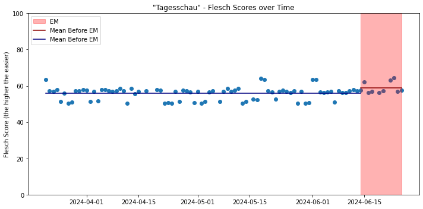
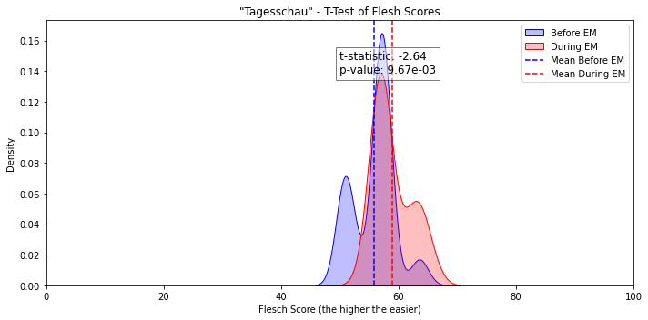

# Question

One Day during lunch my commiilitons found out that both recognized the change in languagelevel in the news during the EM. 
The Theory behind it was that news are now made in a way that drunk (stupid) "footballpeople" can also understand them.


Will the wording of the Tagesschau news bulletins broadcast during the European Championships be formulated in simpler language?

# Method

To answer the question, YouTube videos from the last few months are first scraped and then automatically labeled using readability measurements ála Flesch. 


# Analyse


```python
#pip install pandas matplotlib textstat scipy seaborn
```


```python
import pandas as pd
import matplotlib.pyplot as plt
import textstat 
from scipy import stats
import seaborn as sns
import re
```

    /usr/lib/python3/dist-packages/scipy/__init__.py:146: UserWarning: A NumPy version >=1.17.3 and <1.25.0 is required for this version of SciPy (detected version 1.26.4
      warnings.warn(f"A NumPy version >={np_minversion} and <{np_maxversion}"


```python
df = pd.read_csv('data/data.csv')

if 'ID' not in df.columns:
    df['ID'] = range(1, len(df) + 1)

df.head()
```


<div>
<style scoped>
    .dataframe tbody tr th:only-of-type {
        vertical-align: middle;
    }

    .dataframe tbody tr th {
        vertical-align: top;
    }

    .dataframe thead th {
        text-align: right;
    }
</style>
<table border="1" class="dataframe">
  <thead>
    <tr style="text-align: right;">
      <th></th>
      <th>ID</th>
      <th>url</th>
      <th>path</th>
      <th>text</th>
      <th>title</th>
      <th>date</th>
    </tr>
  </thead>
  <tbody>
    <tr>
      <th>0</th>
      <td>1</td>
      <td>https://www.youtube.com/watch?v=pWuYkzRypf8</td>
      <td>audio/1_tagesschau.mp3</td>
      <td>Hier ist das erste deutsche Fernsehen mit der...</td>
      <td>tagesschau 20:00 Uhr, 25.06.2024</td>
      <td>2024-06-25</td>
    </tr>
    <tr>
      <th>1</th>
      <td>2</td>
      <td>https://www.youtube.com/watch?v=MAmyhxJoZFM</td>
      <td>audio/2_tagesschau.mp3</td>
      <td>Hier ist das erste deutsche Fernsehen mit der...</td>
      <td>tagesschau 20:00 Uhr, 24.06.2024</td>
      <td>2024-06-24</td>
    </tr>
    <tr>
      <th>2</th>
      <td>3</td>
      <td>https://www.youtube.com/watch?v=AVqitc2vJ0c</td>
      <td>audio/3_tagesschau.mp3</td>
      <td>Hier ist das erste deutsche Fernsehen mit der...</td>
      <td>tagesschau 20:00 Uhr, 23.06.2024</td>
      <td>2024-06-23</td>
    </tr>
    <tr>
      <th>3</th>
      <td>4</td>
      <td>https://www.youtube.com/watch?v=Nmwe8gXfu1c</td>
      <td>audio/4_tagesschau.mp3</td>
      <td>Hier ist das erste deutsche Fernsehen mit der...</td>
      <td>tagesschau 20:00 Uhr, 22.06.2024</td>
      <td>2024-06-22</td>
    </tr>
    <tr>
      <th>4</th>
      <td>5</td>
      <td>https://www.youtube.com/watch?v=-okNLhbCcHc</td>
      <td>audio/5_tagesschau.mp3</td>
      <td>Hier ist das erste deutsche Fernsehen mit der...</td>
      <td>tagesschau 20:00 Uhr, 20.06.2024</td>
      <td>2024-06-20</td>
    </tr>
  </tbody>
</table>
</div>


```python
def extract_date(title):
    date_pattern = re.compile(r'\b\d{1,2}\.\d{1,2}\.\d{2,4}\b')
    match = date_pattern.search(title)
    return match.group(0) if match else None
    
def convert_date(date_str):
    for fmt in ('%d.%m.%Y', '%d.%m.%y'):
        try:
            return pd.to_datetime(date_str, format=fmt)
        except ValueError:
            continue
    return None

df['date'] = df['title'].apply(extract_date)
df['date'] = df['date'].apply(convert_date)

df.head()
```


<div>
<style scoped>
    .dataframe tbody tr th:only-of-type {
        vertical-align: middle;
    }

    .dataframe tbody tr th {
        vertical-align: top;
    }

    .dataframe thead th {
        text-align: right;
    }
</style>
<table border="1" class="dataframe">
  <thead>
    <tr style="text-align: right;">
      <th></th>
      <th>ID</th>
      <th>url</th>
      <th>path</th>
      <th>text</th>
      <th>title</th>
      <th>date</th>
    </tr>
  </thead>
  <tbody>
    <tr>
      <th>0</th>
      <td>1</td>
      <td>https://www.youtube.com/watch?v=pWuYkzRypf8</td>
      <td>audio/1_tagesschau.mp3</td>
      <td>Hier ist das erste deutsche Fernsehen mit der...</td>
      <td>tagesschau 20:00 Uhr, 25.06.2024</td>
      <td>2024-06-25</td>
    </tr>
    <tr>
      <th>1</th>
      <td>2</td>
      <td>https://www.youtube.com/watch?v=MAmyhxJoZFM</td>
      <td>audio/2_tagesschau.mp3</td>
      <td>Hier ist das erste deutsche Fernsehen mit der...</td>
      <td>tagesschau 20:00 Uhr, 24.06.2024</td>
      <td>2024-06-24</td>
    </tr>
    <tr>
      <th>2</th>
      <td>3</td>
      <td>https://www.youtube.com/watch?v=AVqitc2vJ0c</td>
      <td>audio/3_tagesschau.mp3</td>
      <td>Hier ist das erste deutsche Fernsehen mit der...</td>
      <td>tagesschau 20:00 Uhr, 23.06.2024</td>
      <td>2024-06-23</td>
    </tr>
    <tr>
      <th>3</th>
      <td>4</td>
      <td>https://www.youtube.com/watch?v=Nmwe8gXfu1c</td>
      <td>audio/4_tagesschau.mp3</td>
      <td>Hier ist das erste deutsche Fernsehen mit der...</td>
      <td>tagesschau 20:00 Uhr, 22.06.2024</td>
      <td>2024-06-22</td>
    </tr>
    <tr>
      <th>4</th>
      <td>5</td>
      <td>https://www.youtube.com/watch?v=-okNLhbCcHc</td>
      <td>audio/5_tagesschau.mp3</td>
      <td>Hier ist das erste deutsche Fernsehen mit der...</td>
      <td>tagesschau 20:00 Uhr, 20.06.2024</td>
      <td>2024-06-20</td>
    </tr>
  </tbody>
</table>
</div>


```python
textstat.set_lang("de")
df['flesch'] = df.apply(lambda row: textstat.flesch_reading_ease(row['text']), axis=1)
df.head()
```


<div>
<style scoped>
    .dataframe tbody tr th:only-of-type {
        vertical-align: middle;
    }

    .dataframe tbody tr th {
        vertical-align: top;
    }

    .dataframe thead th {
        text-align: right;
    }
</style>
<table border="1" class="dataframe">
  <thead>
    <tr style="text-align: right;">
      <th></th>
      <th>ID</th>
      <th>url</th>
      <th>path</th>
      <th>text</th>
      <th>title</th>
      <th>date</th>
      <th>flesch</th>
    </tr>
  </thead>
  <tbody>
    <tr>
      <th>0</th>
      <td>1</td>
      <td>https://www.youtube.com/watch?v=pWuYkzRypf8</td>
      <td>audio/1_tagesschau.mp3</td>
      <td>Hier ist das erste deutsche Fernsehen mit der...</td>
      <td>tagesschau 20:00 Uhr, 25.06.2024</td>
      <td>2024-06-25</td>
      <td>57.65</td>
    </tr>
    <tr>
      <th>1</th>
      <td>2</td>
      <td>https://www.youtube.com/watch?v=MAmyhxJoZFM</td>
      <td>audio/2_tagesschau.mp3</td>
      <td>Hier ist das erste deutsche Fernsehen mit der...</td>
      <td>tagesschau 20:00 Uhr, 24.06.2024</td>
      <td>2024-06-24</td>
      <td>56.85</td>
    </tr>
    <tr>
      <th>2</th>
      <td>3</td>
      <td>https://www.youtube.com/watch?v=AVqitc2vJ0c</td>
      <td>audio/3_tagesschau.mp3</td>
      <td>Hier ist das erste deutsche Fernsehen mit der...</td>
      <td>tagesschau 20:00 Uhr, 23.06.2024</td>
      <td>2024-06-23</td>
      <td>64.60</td>
    </tr>
    <tr>
      <th>3</th>
      <td>4</td>
      <td>https://www.youtube.com/watch?v=Nmwe8gXfu1c</td>
      <td>audio/4_tagesschau.mp3</td>
      <td>Hier ist das erste deutsche Fernsehen mit der...</td>
      <td>tagesschau 20:00 Uhr, 22.06.2024</td>
      <td>2024-06-22</td>
      <td>63.00</td>
    </tr>
    <tr>
      <th>4</th>
      <td>5</td>
      <td>https://www.youtube.com/watch?v=-okNLhbCcHc</td>
      <td>audio/5_tagesschau.mp3</td>
      <td>Hier ist das erste deutsche Fernsehen mit der...</td>
      <td>tagesschau 20:00 Uhr, 20.06.2024</td>
      <td>2024-06-20</td>
      <td>57.25</td>
    </tr>
  </tbody>
</table>
</div>


Die EM startete am 14. Juni.

| Score  | Difficulty        |
|--------|-------------------|
| 90-100 |  Very Easy        |
| 80-89  | 	Easy             |
| 70-79  | 	Fairly Easy      |
| 60-69  | 	Standard         |
| 50-59  | 	Fairly Difficult |
| 30-49  | 	Difficult        |
| 0-29   | 	Very Confusing   |


```python
df['date'] = pd.to_datetime(df['date'], errors='coerce')
df = df.dropna(subset=['date'])

start_date = pd.to_datetime("2024-06-14")
end_date = pd.to_datetime(max(df['date']))


mean_before_em = df[df['date'] < start_date]['flesch'].mean()
mean_during_em = df[(df['date'] >= start_date) & (df['date'] <= end_date)]['flesch'].mean()


# Plotting
plt.figure(figsize=(10, 5))
plt.scatter(df['date'], df['flesch'], marker='o')
plt.axvspan(start_date, end_date, color='red', alpha=0.3, label='EM')

plt.plot([start_date, end_date], [mean_during_em, mean_during_em], color='darkred', linestyle='-', label='Mean Before EM')
plt.plot([pd.to_datetime(min(df['date'])), start_date], [mean_before_em, mean_before_em], color='navy', linestyle='-', label='Mean Before EM')


plt.ylabel('Flesch Score (the higher the easier)')
plt.title('"Tagesschau" - Flesch Scores over Time')
plt.grid(False)
plt.ylim(0, 100)
plt.tight_layout()
plt.legend()

plt.show()

```


    

    


## T-Test


```python
before_em = df[df['date'] < pd.to_datetime("2024-06-14")]['flesch']
during_em = df[(df['date'] >= pd.to_datetime("2024-06-14")) & (df['date'] <= pd.to_datetime(max(df['date'])))]['flesch']

t_stat, p_value = stats.ttest_ind(before_em, during_em)
```


```python
plt.figure(figsize=(10, 5))
sns.kdeplot(before_em, label='Before EM', color='blue', fill=True)
sns.kdeplot(during_em, label='During EM', color='red', fill=True)
plt.axvline(before_em.mean(), color='blue', linestyle='--', label='Mean Before EM')
plt.axvline(during_em.mean(), color='red', linestyle='--', label='Mean During EM')

plt.annotate(f't-statistic: {t_stat:.2f}\np-value: {p_value:.2e}', 
             xy=(0.5, 0.8), xycoords='axes fraction', fontsize=12,
             bbox=dict(facecolor='white', alpha=0.5))
plt.xlim(0, 100)

plt.xlabel('Flesch Score (the higher the easier)')
plt.ylabel('Density')
plt.title('"Tagesschau" - T-Test of Flesh Scores')
plt.grid(False)

plt.legend()
plt.tight_layout()

plt.show()
```


    

    


The densityplot shows that the difference in means probably occurs because of the outliers, wich are also seen in the first plot. 

To answer the question definitely we have to wait until a few weeks after the EM and see if the languagelevel goes _back to normal lows_.

Until then we can conclude the general impression that languagelevel changed is only partly legitimized.
